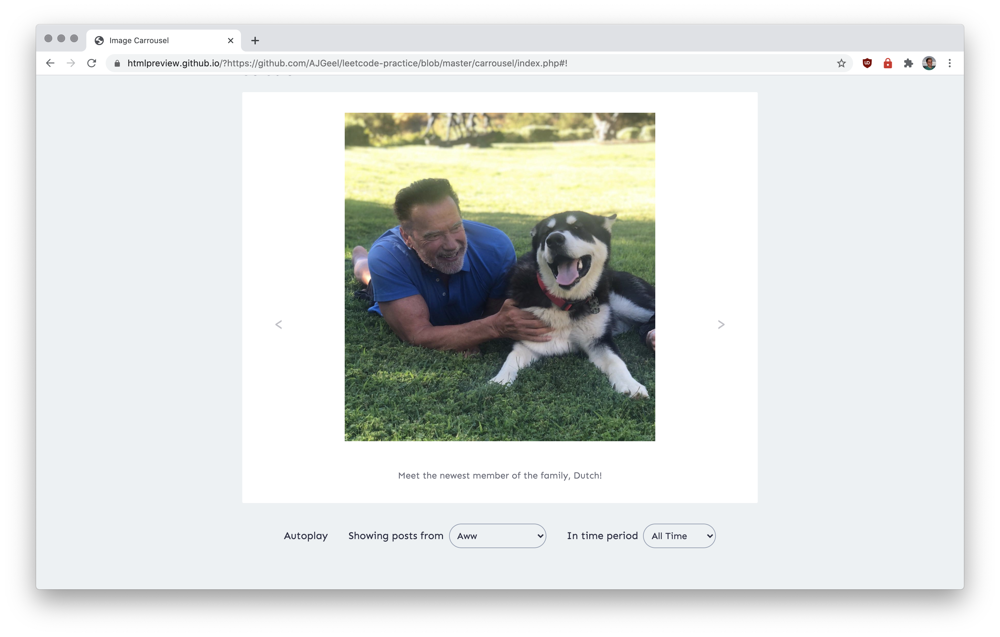

# Leetcode Practice

These are a number of front-end exercises to practice potential interview questions. Rather than `leetcode`, trivia-style questions on algorithms, these exercises are more representative of the role of a front-end developer, addressing the fields of system design and practical front-end coding.

## Challenges

1. **Data Fetching &amp; Visualization**

*Retrieve a list of numbers from an endpoint, then plot a histogram showing the frequency of each number in the list. The histogram should have appropriately numbered x and y axes.*

2. **Image Carrousel**

*Create an image carousel that cycles through images fetched from an endpoint (displaying a new image every 3 seconds), and allows the user to skip to the next/previous image.*

3. **Snake Game**

*Create a Snake game that meets the following requirements: (...)*

## Credit
Originally, these practice questions were shared by [/u/jayrobin](https://www.reddit.com/r/webdev/comments/hyuznw/i_wanted_to_share_some_front_end_practice/) on Reddit. These solutions were created by Arthur Geel, generally built using vanilla JS.
